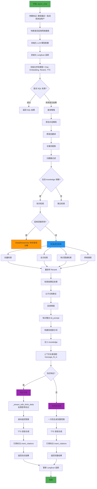

## async_chat 流程图



## 🎯 简要实现介绍

### 核心流程

`async_chat` 是 RAGFlow 对话系统的核心引擎，完整的 RAG 流程包含以下阶段：

#### 1. **预处理阶段**
- 验证消息格式（最后一条必须来自用户）
- 判断是否启用网络搜索
- 初始化所有模型（Chat、Embedding、Rerank、TTS）
- 初始化 Langfuse 可观测性追踪

#### 2. **SQL 检索尝试**
- 检测文档引擎（Infinity/OceanBase/ES）
- 尝试将自然语言问题转为 SQL
- 成功则直接返回结构化查询结果

#### 3. **查询增强**
- **多轮对话精炼**：将多轮对话合并为完整问题
- **跨语言翻译**：翻译成多种语言
- **关键词提取**：提取核心关键词
- **元数据过滤**：应用元数据过滤条件

#### 4. **知识检索**
- **深度研究模式**：树状查询分解，递归检索
- **标准模式**：
  - 向量检索（语义相似）
  - 全文检索（关键词匹配）
  - 知识图谱检索（关系推理）
  - 网络搜索（Tavily）

#### 5. **后处理**
- 重排序（Rerank）优化排序
- 父子文档聚合
- 目录增强（TOC）

#### 6. **生成阶段**
- 知识整合为提示词
- 上下文长度适配
- 流式/非流式生成
- 思考标记处理（`<think>`）
- 引用标注（`[ID:xxx]`）
- TTS 语音合成

## ⚡ 设计亮点

### 1. **多级检索策略**
```
SQL 检索 → 向量检索 → 全文检索 → 知识图谱 → 网络搜索
```
- 从结构化到非结构化逐级尝试
- 最大化召回率和精确度

### 2. **树状查询分解（深度研究）**
```
原始问题
├── 子查询1
├── 子查询2
└── 子查询3
    ├── 子查询3.1
    └── 子查询3.2
```
- 自动分解复杂问题
- 递归检索直到信息充分
- 并行执行子查询

### 3. **智能查询增强**
- **多轮精炼**：`full_question` 将上下文补充完整
- **跨语言**：`cross_languages` 翻译查询
- **关键词提取**：`keyword_extraction` 补充关键词

### 4. **流式思考标记处理**
```
<think>推理过程</think> → 前端折叠显示
```
- 支持 DeepSeek R1 等模型的推理过程
- 用户可查看或隐藏推理链

### 5. **引用标注系统**
```
Python是一种高级编程语言[ID:1][ID:3]
```
- 混合检索（BM25 + 向量）
- 自动插入引用标记
- 可追溯信息来源

### 6. **多模态支持**
- 支持图片输入
- 自动转换为多模态格式
- 适配 OpenAI/Gemini/Anthropic

### 7. **可观测性**
- Langfuse 追踪
- 各阶段耗时监控
- Token 使用量统计

### 8. **错误容忍与降级**
- Langfuse 连接失败不影响主流程
- SQL 检索失败自动重试
- 深度研究异常不影响主答案

### 9. **性能优化**
- 上下文长度适配（`message_fit_in`）
- Token 预算控制
- 并行检索和生成

### 10. **多租户隔离**
- 每个租户独立配置
- 独立的模型实例
- 数据隔离