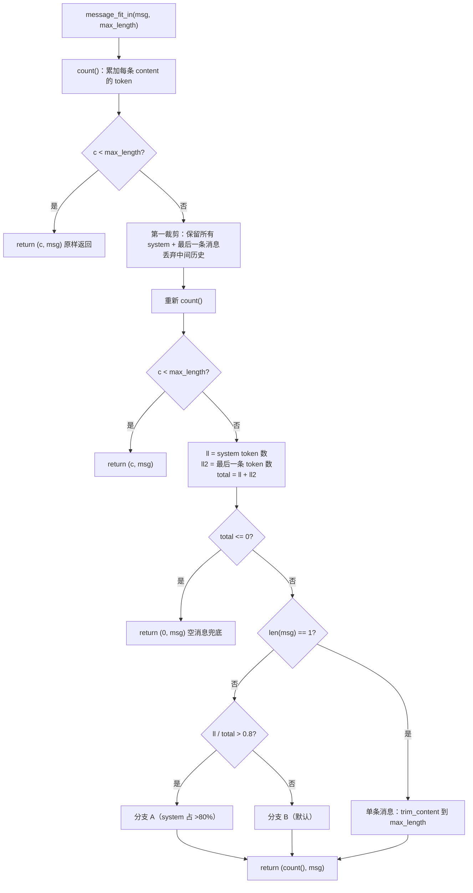
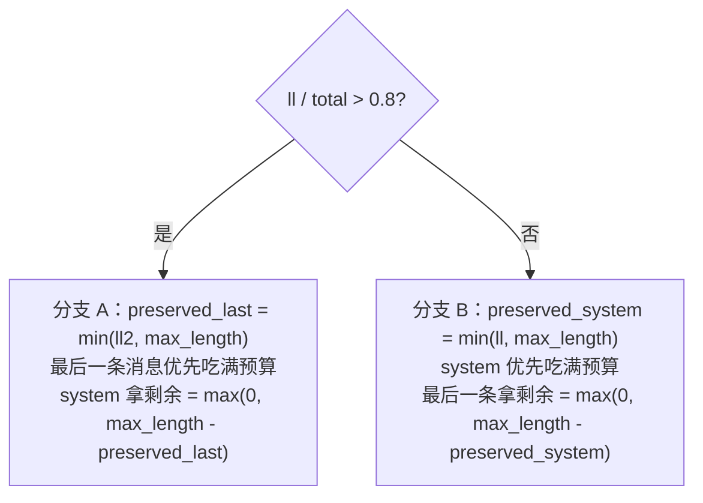

message_fit_in 是 RAGFlow 里「消息窗口适配」的核心工具函数：给定消息列表和 token 预算上限，动态裁剪消息，
保证发给 LLM 的 prompt 不超出模型上下文窗口。它被聊天链路、Agent 链路、以及 generator 里几乎所有 LLM 调用复用。

签名：`message_fit_in(msg, max_length=4000) -> (used_token_count, fitted_msg)`。
返回两个值：裁剪后的消息列表，以及裁剪后实际占用的 token 数（供调用方反向计算生成预算）。

# 一、调用位置

| 调用方 | max_length 预算 | 说明 |
|--------|----------------|------|
| dialog_service.py:890 | `int(max_tokens * 0.95)` | 最终答案生成前，裁剪 system + 历史 |
| agent/component/llm.py:295 | `int(max_length * 0.97)` | Agent LLM 组件 |
| agent/component/agent_with_tools.py:186 | `int(max_length * 0.97)` | 带工具 Agent 格式化历史 |
| rag/graphrag/extractor.py:85 | `int(max_length * 0.92)` | GraphRAG 抽取 |
| generator.py 多处 | `chat_mdl.max_length`（100%） | keyword_extraction / gen_json / gen_metadata 等 |

关键点：**不同调用方用不同的安全系数（0.92 / 0.95 / 0.97 / 1.0）**。留出的余量是为了
① 覆盖 message_fit_in 没算进去的 role 标记 / chat template 结构开销；② 给模型的输出 token 留空间。

# 二、主流程



# 三、两种裁剪手段

1. **丢弃中间消息**（第一裁剪，行 127-130）：只保留「所有 `system` 消息 + 最后一条消息」，中间的历史 `user/assistant` 直接丢掉。
   - 语义：system 是重要指令/知识，最后一条是最新用户输入，历史对话非关键。
2. **按 token 截断内容**（第二裁剪，`trim_content`）：对单条 content 做「编码 → 截前 N 个 token → 解码」，
   保证在 token 边界截断而非字符边界（`common/token_utils.py` 的 `truncate` 同款逻辑）。

# 四、第二裁剪的两个分支（system vs 最后一条的预算分配）

当裁掉中间历史后仍超限，进入按 token 截断，此时根据「system 是否占大头」走两条不同策略：



- **分支 A（system 占 >80%）**：此时 system 是超限的「主犯」，代码反而**优先保留最后一条消息**（用户当前问题），system 只拿剩余预算。
  语义上可理解为「问题本身不能丢，宁可砍 system」。
- **分支 B（默认，system ≤80%）**：system 较小，先完整保留 system（上限 max_length），剩余预算给最后一条消息。
  这是最常见的情形：system 提示词 + 知识通常能塞下，超限的是用户历史，砍的是最后一条消息。

⚠️ 注意：`generator.py:156-174` 那段长注释对分支 A 的定性是「优先保证系统消息完整性」，与代码实际行为（`preserved_last = min(ll2, max_length)` 优先保留最后一条）**相反**，属于注释与实现不符。

# 五、设计方案要点

1. 统一 token 计数，但非模型专属

- `encoder = tiktoken.get_encoding("cl100k_base")`（`common/token_utils.py:26`），是 GPT-3.5/GPT-4 的 BPE 编码，
  **对所有模型统一用这一套**，不做按模型区分。
- 代价：对非 OpenAI 模型（如 Qwen、DeepSeek 等）token 数是**近似值**，不是精确值。这是「简单 + 可移植」与「精确」之间的取舍。

2. 计数永不抛异常

- `num_tokens_from_string` 内部 try/except，失败返回 0（`common/token_utils.py:31-35`）。
  保证 message_fit_in 在任何脏输入下都不会因编码失败而崩溃。

3. 返回值被反向用于压缩生成预算

- 典型用法（dialog_service.py:890-897）：
  ```python
  used_token_count, msg = message_fit_in(msg, int(max_tokens * 0.95))
  ...
  if "max_tokens" in gen_conf:
      gen_conf["max_tokens"] = min(gen_conf["max_tokens"], max_tokens - used_token_count)
  ```
  即「输入占了多少 token，就从生成预算里扣多少」，避免「输入 + 输出」总和超出模型上限。

4. 两阶段裁剪 = 先保结构、后压细节

- 第一阶段的「丢中间历史」是粗粒度、语义驱动（保 system + 最后一条）；
- 第二阶段的「token 截断」是细粒度、数值驱动（按 token 预算切）。
- 二者组合，先用便宜手段（丢历史）解决大部分超限，再用昂贵但精确的手段（token 截断）兜底。

5. 边界情况与潜在问题

- **单条超长非 system 消息会被整体丢弃**：若 `msg` 只有一条非 system 消息且超限，第一裁剪后 `msg_` 为空列表，
  `count()=0 < max_length` 直接 `return (0, [])`——消息内容被清空而非截断（`len(msg)==1` 的截断分支走不到）。
  好在现有调用方基本都带 system 消息，实际触发面很小。
- **多条 system 消息时只裁剪第一条**：第一裁剪会保留**所有** system 消息，而第二裁剪只处理 `msg[0]`（第一条 system）和
  `msg[-1]`（最后一条），中间的 system 消息不被截断但照常计入 `count()`，所以返回值理论上**不严格保证 <= max_length**。
  例如 citation_prompt 可能额外追加一条 system（引用指南）时，会出现 2 条 system 的场景。
- **空消息兜底**：`total <= 0`（所有 content 为空）时返回 `(0, msg)` 原样，不报错（对应单测 test_handles_zero_token_messages）。

# 六、单元测试锚定的行为

`test/unit_test/rag/prompts/test_generator_message_fit_in.py` 用「每字符 = 1 token」的假 encoder 精确锚定了四个行为：

1. 常规裁剪：system 完整保留、user 被截断到剩余预算（`max_length=8` → system `"1234"` + user `"abcd"`）。
2. 空消息 + `max_length=0`：返回 `(0, 原 msg)`，不崩。
3. 负长度 clamp：`max_length=2` 时 `trim_content` 内部 `max(0, limit)`，user 被截成 `""`。
4. system 占大头（>80%）：system 被截成 `""`、最后一条 user 完整保留（对应分支 A）。
