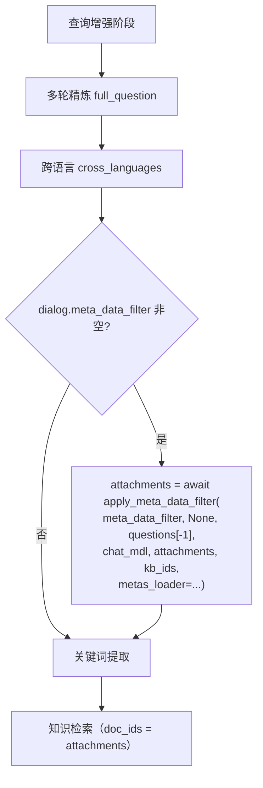
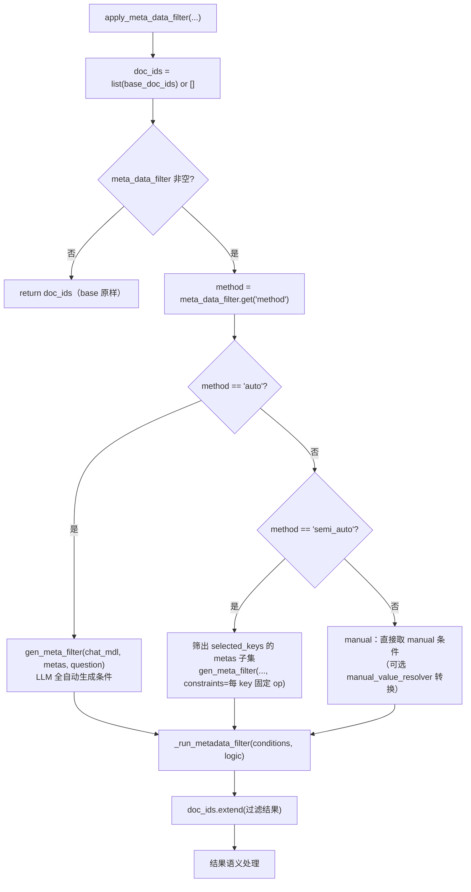
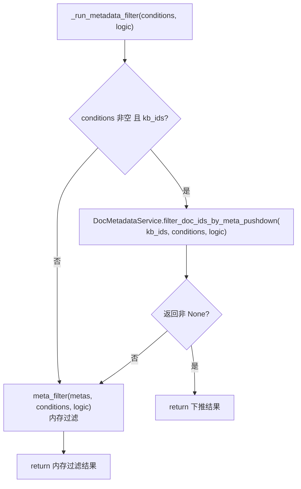
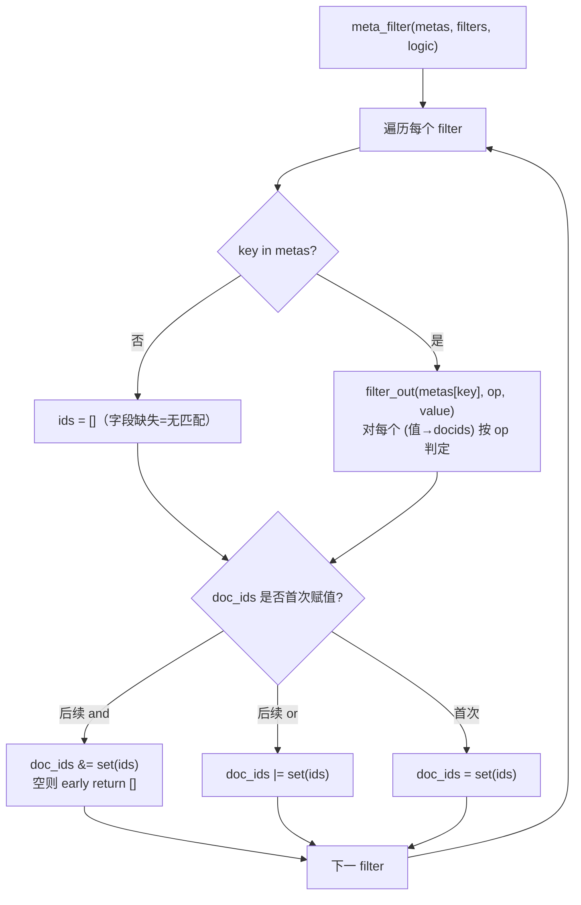

apply_meta_data_filter 是 RAGFlow 的「元数据过滤」执行器：根据用户在聊天/检索里配置的过滤规则，把检索范围收窄到
「元数据满足条件」的那些文档。它支持三种模式（auto / semi_auto / manual），并且「优先数据库下推、失败回退内存」，
最终返回一个文档 ID 列表（doc_ids），下游检索用它做 `doc_ids=` 过滤。

签名：`apply_meta_data_filter(meta_data_filter, metas=None, question="", chat_mdl=None, base_doc_ids=None, manual_value_resolver=None, kb_ids=None, metas_loader=None) -> list[str] | None`

# 一、触发位置

（在 async_chat 的查询增强阶段） 位于跨语言之后、关键词提取之前，由 `dialog.meta_data_filter` 非空触发。



关键点：

- 过滤结果回写 `attachments`（即检索用的 `doc_ids`），所以元数据过滤**直接影响后续 `retriever.retrieval(..., doc_ids=attachments)` 的召回范围**。
- 调用方不止聊天链路：`agent/tools/retrieval.py:185`、`bot_api.py:356`、`dataset_api_service.py:1113/1500` 都复用同一函数。

# 二、主流程



三种模式对比：

| 模式 | LLM 参与 | 输入 | 说明 |
|------|---------|------|------|
| auto | 全自动 | question + 全量 metas | LLM 从问题里提取所有过滤条件 |
| semi_auto | 半自动 | question + 指定 key 的 metas | 只对用户指定的维度提取值，可约束 op |
| manual | 不参与 | 直接给 conditions | 开发者/用户手动写死过滤条件 |

# 三、两条执行路径（`_run_metadata_filter`）



- **下推路径**：有 `kb_ids` 时，把过滤条件下推到 ES/Infinity 的文档元数据索引里执行，避免把整表元数据拉回 Python 内存，性能更好。
- **内存路径**：无 `kb_ids`、下推不支持、下推报错时回退，用 `meta_filter` 在 Python 内存里对 `metas` 做过滤。
- 下推函数返回语义：`None` = 「不适用，回退内存」；`[]` = 「索引不存在等，确定性无结果」（不触发回退）。
- **懒加载 metas**：`metas_loader` 只在真正需要内存数据时才调用（auto/semi_auto 的 LLM 上下文、或内存回退时）。
  manual + 下推成功的路径**完全跳过** `get_flatted_meta_by_kbs` 这趟昂贵的 DB 查询。

# 四、内存过滤引擎 `meta_filter`

`metas` 是「扁平化倒排」结构 `{字段名: {值: [doc_ids]}}`（由 `get_flatted_meta_by_kbs` 生成），
`filters` 是 `{key, op, value}` 列表，`logic` 是 and/or。



操作符全集：`contains` / `not contains` / `in` / `not in` / `start with` / `end with` / `empty` / `not empty` / `=` / `≠` / `>` / `<` / `≥` / `≤`。

值匹配的两个特殊处理（`filter_out`）：

1. **日期识别（严格 `YYYY-MM-DD`）**：比较类操作符下，若查询值是 10 位日期字符串，则只对同样是日期的元数据值做字符串比较，
   非日期的值直接跳过（不匹配）；若查询值不是日期，则走普通类型推断。
2. **类型推断（`ast.literal_eval`）**：非日期场景用 `ast.literal_eval` 把字符串尽量还原成 int/float/str，再比较；
   字符串统一 lower 后再比，实现大小写不敏感。

# 五、设计方案要点

1. 三种模式 = 三种 LLM 参与度

- auto：LLM 全权决定过滤哪些字段、用什么值、什么操作符。
- semi_auto：用户指定要过滤的字段（`semi_auto` 列表），LLM 只从这些字段里提取值；字段可带固定操作符约束（`constraints`）。
- manual：完全不走 LLM，直接用手写条件。这是「不信任 LLM」或「规则已知」场景的选择。

2. 下推优先、内存兜底（性能 vs 兼容）

- 下推把过滤放到底层索引，省掉「拉全量元数据 → Python 过滤」的开销，尤其是大知识库。
- 内存兜底保证无 kb_ids / 后端不支持 / 下推报错时行为一致，`meta_filter` 是纯 Python、无外部依赖。

3. 懒加载元数据（`metas_loader` 闭包 + memoise）

- `_get_metas()` 每次调用至多 materialise 一次；manual + 下推成功根本不触发加载。
- 这是对「元数据过滤最贵的开销就是拉元数据」的针对性优化。

4. 返回值的三种语义（下游必须区分）

- `list[str]`：正常结果（可能是 base_doc_ids 与过滤结果的并集）。
- `None`：auto/semi_auto 无结果 → 表示「过滤规则没匹配到，忽略过滤」。
- `["-999"]`：manual 有过滤条件但无结果 → 哨兵值，表示「明确无匹配」，下游检索 `doc_ids=["-999"]` 会召回空。

5. base_doc_ids 是「并集」而非「交集」

- `doc_ids = list(base_doc_ids)` 后 `doc_ids.extend(过滤结果)`，即过滤结果**追加**到已有 base 上（并集语义）。
- 意味着：当用户同时「显式指定了 doc_ids」又「配置了元数据过滤」时，元数据过滤不会缩小显式选择范围。
  （`filter_doc_ids_by_meta_pushdown` 的 docstring 也写明「union or intersect」由调用方决定，此处实现选了 union。）

6. gen_meta_filter 的容错

- 输出用 `json_repair.loads` 解析，剥离 `</think>` 与 ```json 围栏；校验必须是 dict 且含 `conditions` 列表，
  失败则返回 `{"conditions": []}`（等价于不过滤），保证不会因 LLM 输出异常而崩溃。

7. 相关辅助函数

- `convert_conditions`（metadata_utils.py:23-40）：把旧版 `metadata_condition` 格式（`{name, comparison_operator, value}`）
  映射成 filter 格式（`is→=`、`not is→≠` 等），是**另一条**兼容入口，不在 `apply_meta_data_filter` 内部调用。
- `get_flatted_meta_by_kbs`：把 `{字段: {值: [doc_id]}}` 扁平化，是内存过滤 `metas` 的数据来源。

# 六、提示词模板（rag/prompts/meta_filter.md）

- 角色：元数据过滤条件生成器。
- 输入：`metadata_keys`（各字段及可取值）、`user_question`、`current_date`、可选 `constraints`。
- 输出：`{"logic": "and"/"or", "conditions": [{key, value, op}]}`。
- 操作符白名单：`contains / not contains / in / not in / start with / end with / empty / not empty / = / ≠ / > / < / ≥ / ≤`。
- 关键规则：
  - 日期统一 `YYYY-MM-DD`，区间拆成两条（`≥ start` + `< end`），缺少年份时从当前日期推断。
  - 否定词统一用 `≠`（如「不要蓝色」→ `{"key":"color","value":"blue","op":"≠"}`）。
  - 值必须精确匹配元数据里的可取值，字段/值不存在就跳过。
  - 有 `constraints` 时，对应 key 必须用指定操作符。
- 带 2 组示例（中文日期/排除场景、or 组合场景）+ JSON Schema 约束。
