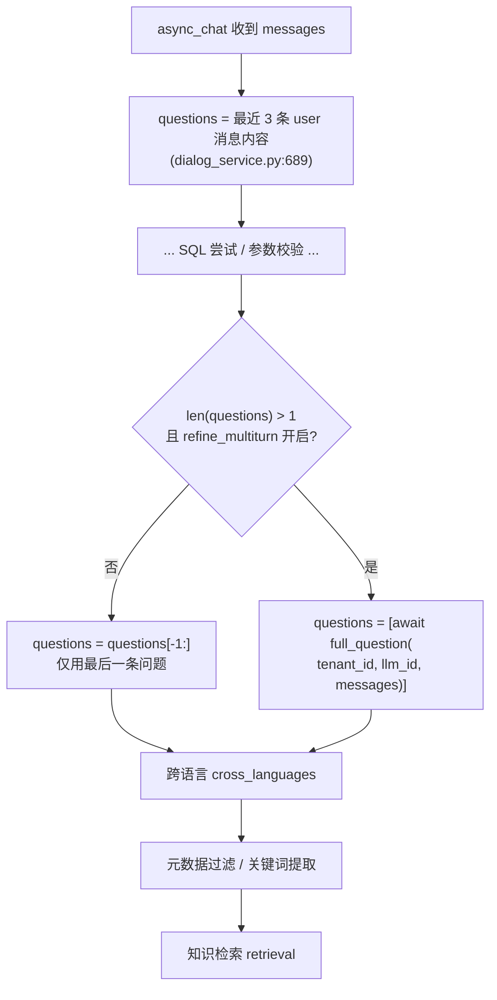
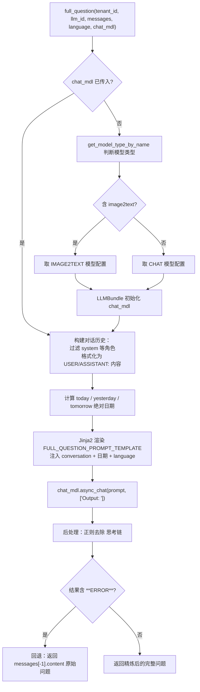

full_question 是 RAGFlow 聊天里「多轮对话精炼」的核心函数：把用户在多轮对话中的最后一句话（可能带着指代、省略），
结合历史上下文，改写成一个完整、自包含的问题，让后面的检索（向量/SQL/图谱）拿到足够信息。下面是它的流程图和设计方案。

# 一、触发位置

（在 async_chat 中） full_question 在查询增强阶段被调用，位于 SQL 尝试之后、知识检索之前，且失败会自动回退到「仅用最后一句」。



关键点：

- questions 来源是 `[m["content"] for m in messages if m["role"]=="user"][-3:]`（dialog_service.py:689），**只取最近 3 条用户消息**。
- 触发条件有两个：`len(questions) > 1`（确实是多轮）**且** `refine_multiturn` 配置开启（dialog_service.py:749）。
- `refine_multiturn` 默认值：RESTful API 默认 `True`（chat_api.py:102/111），但 Go 客户端 / `use-create-chat.ts` 默认 `False`，
  前端新建聊天页默认 `True`（chat-settings.tsx:56）。也就是说**是否精炼由每个 dialog 的 prompt_config 决定**。

第二个调用点是 Agent 的 `agent_with_tools.py:266`：

```python
if len(msg) > 3:
    user_request = await full_question(messages=msg, chat_mdl=self.chat_mdl)
    msg = [*msg[:-1], {"role": "user", "content": user_request}]
```

这里直接复用 Agent 自己的 `chat_mdl`（不传 `tenant_id/llm_id`），条件是消息条数 > 3。

# 二、full_question 内部运行流程



# 三、设计方案要点

1. 模型复用，不额外指定模型

- 传入 `chat_mdl` 时直接复用（Agent 场景）。
- 未传入时，根据 `llm_id` 判断模型类型：`image2text` → 用 `LLMType.IMAGE2TEXT`，否则 `LLMType.CHAT`（generator.py:354-360）。
  和 `cross_languages` 的选择逻辑一致，保证精炼用的是和正式回答相同的模型。

2. 对话历史格式固定为纯文本

- 过滤掉 `system` 等非对话角色，只保留 `user/assistant`（generator.py:365-368）。
- 统一拼成 `USER: xxx\nASSISTANT: xxx` 文本，注入模板的 `{{ conversation }}` 占位符。注意这里**不含 system 提示词**，
  避免把角色设定塞进精炼上下文。

3. 日期上下文注入（相对日期 → 绝对日期）

- 模板里把 `today/yesterday/tomorrow` 三个绝对日期注入，要求 LLM 把「昨天/明天」这类相对时间转成绝对日期
  （见 full_question_prompt.md 第 6-7 行与 Example 3）。
- 日期在函数内用 `datetime.date.today()` 现场计算（generator.py:373-375），保证时效。

4. 语言控制

- `language` 参数默认 `None`，此时模板走 else 分支：「输出必须与原始问题同语言」。
- dialog_service.py:750 的调用只传了 3 个位置参数，所以 `language=None` → 同语言精炼；如果显式传 `language` 则按指定语言输出。

5. 安全回退（保证可用性优先）

- 若 LLM 返回 `**ERROR**` 标记，直接回退到 `messages[-1]["content"]`（原始最后一句），不阻断后续检索。
- 后处理用 `re.sub(r"^.*</think>", "", ans, flags=re.DOTALL)` 剥离 reasoning 模型的思考链，防止把推理过程当问题喂给检索。

6. 幂等性设计

- 模板明确要求：如果用户最新问题本身已完整，「不要做任何事，直接返回原问题」（full_question_prompt.md 第 10 行），
  配合 few-shot 示例（指代消解、多跳补齐、日期转换三种典型场景）引导 LLM 输出。

7. 一个可留意的代码细节

- 签名里 `messages=[]` 是可变默认参数（generator.py:345）。当前所有调用方都显式传 `messages`，所以没有实际踩坑，
  但属于潜在隐患，后续可改为 `messages=None` 再在函数内判空。

# 四、提示词模板（rag/prompts/full_question_prompt.md）

结构为「Role → Task & Steps → Requirements → Examples（3 组 few-shot）→ Real Data」：

- **Role**：helpful assistant。
- **Task**：生成一条能接续对话的完整用户问题；相对日期转绝对日期。
- **Restrictions**：已是完整问题就原样返回；只输出精炼后的问题；语言约束。
- **3 组示例**覆盖三类场景：
  1. 指代消解（"And his mother?" → "What's the name of Donald Trump's mother?"）
  2. 多跳补齐（"What's her full name?" → 补出 Mary Trump）
  3. 相对日期转换（"tomorrow in Rochester" → 绝对日期）
- **Real Data** 注入真实 `{{ conversation }}`。
