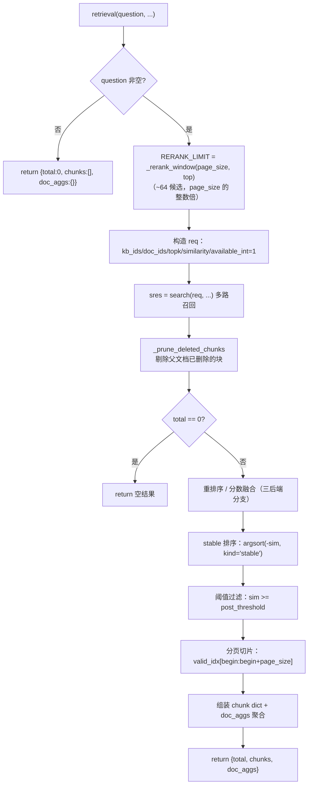
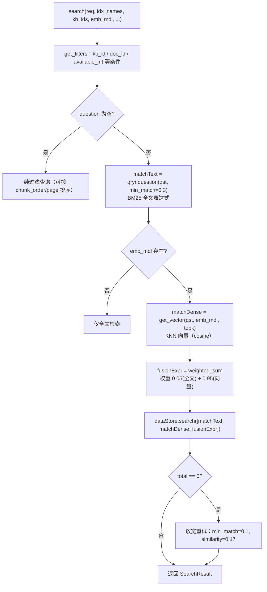
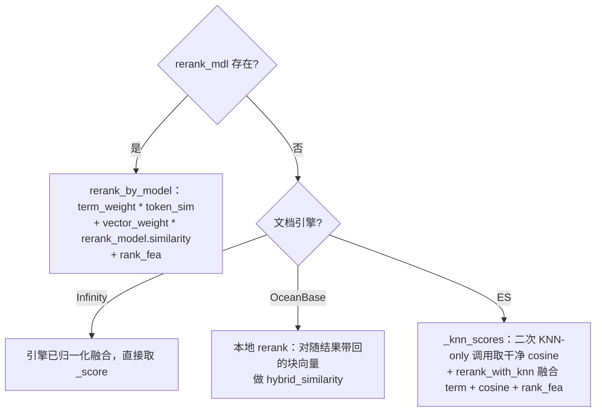

retrieval 是 RAGFlow 的核心检索入口（`rag/nlp/search.py` 的 `Dealer.retrieval`），
把「用户问题 + 过滤条件」经过 **多路召回 → 重排序/分数融合 → 阈值过滤 + 分页 → 结果组装** 四阶段，最终返回
`{total, chunks, doc_aggs}`。向量检索、全文检索、排序特征（PageRank + 标签）在这里统一融合。

签名：`retrieval(question, embd_mdl, tenant_ids, kb_ids, page, page_size, similarity_threshold=0.2, vector_similarity_weight=0.3, top=1024, doc_ids=None, aggs=True, rerank_mdl=None, highlight=False, rank_feature={PAGERANK_FLD:10}, trace_id=None)`

# 一、触发位置

（在 async_chat 的标准检索分支） `Dealer` 实例就是全局 `settings.retriever`，聊天里这样调用：

```python
kbinfos = await retriever.retrieval(
    " ".join(questions), embd_mdl, tenant_ids, dialog.kb_ids,
    1, dialog.top_n,                      # page=1, page_size=top_n
    dialog.similarity_threshold,          # 阈值
    dialog.vector_similarity_weight,      # 向量/全文融合权重
    doc_ids=attachments, top=dialog.top_k, aggs=True,
    rerank_mdl=rerank_mdl,
    rank_feature=label_question(" ".join(questions), kbs),  # 标签特征
)
```

关键点：

- `doc_ids` 来自 `attachments`（含上一节 `apply_meta_data_filter` 的元数据过滤结果），实现「范围收窄」。
- `rank_feature` 在聊天链路不是默认的 `{PAGERANK_FLD:10}`，而是 `label_question(...)` 返回的**标签特征**（问题 vs 标签 KB 的匹配权重），
  见 `rag/app/tag.py:125`。若无标签 KB，则为 `None`，此时 `_rank_feature_scores` 退化为纯 PageRank 加权。

# 二、主流程（四阶段）



# 三、多路召回 `search`（引擎层）



- **粗召回以向量为主**：引擎层 `weighted_sum` 给向量 0.95、全文 0.05，先把候选捞回来。
- **空结果自动放宽**：命中为 0 时把全文 `min_match` 从 0.3 降到 0.1、向量 `similarity` 从 0.1 降到 0.17 再试一次。
- 关键词会经 `rag_tokenizer.fine_grained_tokenize` 细粒度切词扩充（用于高亮匹配）。

# 四、重排序 / 分数融合（三后端分支）

引擎层捞回候选后，应用层重新计算最终分数 `sim`（并拆出 `tsim`/`vsim` 供下游引用）：



- **融合公式**（应用层）：`sim = term_similarity_weight * tksim + vector_similarity_weight * vtsim + rank_fea`，
  其中 `term_similarity_weight = 1 - vector_similarity_weight`（默认 `vector_similarity_weight=0.3` → 全文 0.7 / 向量 0.3）。
- **两层权重分工**：引擎层粗召回偏向量（0.95），应用层精排偏全文（0.7）。这是「向量负责召回、全文负责精排」的设计。
- **term 分数**：把块的 `content_ltks + title_tks*2 + important_kwd*5 + question_tks*6` 加权拼成 token 序列，
  与 query 关键词算 token 相似度（标题/关键词/问题词被放大权重）。
- **rank_feature**（`_rank_feature_scores`）：PageRank 分值恒加；若有 tag 特征，再算 query 标签向量与块标签向量的归一化余弦（×10）。

# 五、设计方案要点

1. 候选窗口与分页对齐（`_rerank_window`）

- `RERANK_LIMIT` 同时是「后端取块大小」和「页内切片模数」：`req["page"] = global_offset // RERANK_LIMIT`、
  `begin = global_offset % RERANK_LIMIT`。为让两者对齐，窗口**必须是 page_size 的整数倍**。
- 默认目标 ~64 个候选（`ceil(64/page_size)*page_size`），有外部 reranker 时再被 `top` 收紧。深分页靠「取对应块 + 块内切片」实现，
  避免每次都全量重排。

2. ES 不再回传块向量（向量留在引擎内）

- 主检索不拉 `q_{dim}_vec`；ES 路径用 `_knn_scores` 二次 KNN-only 调用取「干净 cosine」，块向量不出引擎。
- 引用阶段需要向量时，用 `fetch_chunk_vectors(chunk_ids, ...)` 按需拉取。这是针对「向量传输开销大」的优化。
- OceanBase 仍走老路（随结果带块向量、本地 `rerank`），Infinity 则引擎内已融合，无需应用层重排。

3. 向量字段按维度命名 `q_{dim}_vec`

- 同一索引可容纳不同 embedding 维度的向量列；查询向量维度决定取哪一列，兼容多模型/多维度混存。
- 未取到向量时用 `zero_vector` 占位，保证下游结构稳定。

4. 稳定排序与阈值语义

- `np.argsort(..., kind='stable')` 保证同分时顺序确定，结果可复现。
- `post_threshold = 0 if vector_similarity_weight <= 0 else similarity_threshold`：
  纯全文模式（向量权重 0）下，`similarity_threshold` 对 term 分数无意义，故阈值置 0。

5. 删除文档防御（`_prune_deleted_chunks`）

- 检索后、重排前，把「父文档 DB 行已不存在」的块剔除，避免把已删文档的内容兜出来。
- 注释明确定位为「临时兜底」，不是主删除机制（主删除应在写入侧完成）。

6. 结果结构

- 每个 chunk 带 `similarity` / `vector_similarity` / `term_similarity` 三个分数，供引用排序、调试、重排下游使用。
- `doc_aggs` 按 `docnm_kwd` 聚合（每个文档命中的块数），按 count 降序，供前端「来源文档」统计。

7. 排序特征（rank_feature）的两种形态

- 默认 `{PAGERANK_FLD: 10}`：只用 PageRank 加权。
- 聊天链路传 `label_question(...)`：额外的标签特征余弦（query 标签 vs 块标签，×10 再叠加 PageRank），
  让「带标签的知识库」能按标签相关性加权。

# 六、结果流向

`retrieval` 返回的 `kbinfos` 在 async_chat 里继续走：

1. `retrieval_by_toc`（若 `toc_enhance`）→ 目录增强替换/提权 chunks。
2. `retrieval_by_children`（父子聚合）→ 子块合并回父块。
3. `kb_prompt(kbinfos, max_tokens)` → 格式化为树状文本注入 system prompt。
4. 最终 `message_fit_in` 裁剪后交给 LLM 生成答案。
