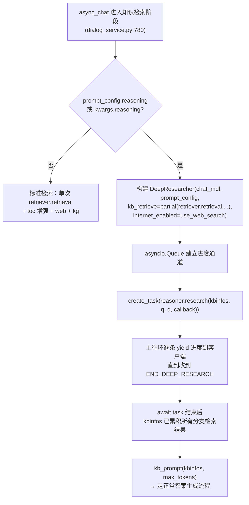
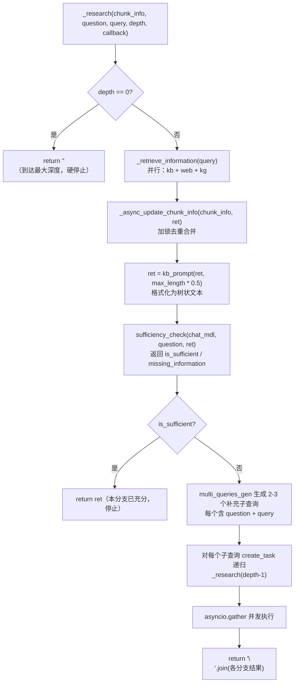
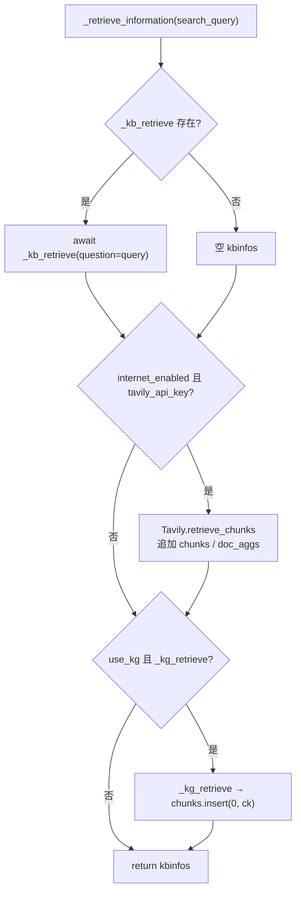

DeepResearcher 是 RAGFlow 聊天的「深度研究」模式：针对复杂问题，用「树状查询分解 + 递归检索 + 充分性判定」的方式，
不断把原始问题拆成子查询去检索，直到信息足够回答为止。它和普通模式（单次向量检索）的区别在于**多轮、多分支、带自我判断**的检索。

关键事实：`DeepResearcher` 是 `TreeStructuredQueryDecompositionRetrieval` 的别名
（rag/advanced_rag/__init__.py:17），类定义在 `rag/advanced_rag/tree_structured_query_decomposition_retrieval.py`。

# 一、触发位置

（在 async_chat 的知识检索阶段） 由 `prompt_config["reasoning"]` 或请求里的 `reasoning` 参数触发，与标准检索互斥。



关键点：

- 触发条件：`if prompt_config.get("reasoning", False) or kwargs.get("reasoning")`（dialog_service.py:784）。`reasoning` 是每个 dialog 的
  prompt_config 里的一项，默认不存在（falsy），即**默认关闭**，需要用户在聊天设置里打开「深度研究」。
- `kb_retrieve` 用 `partial(retriever.retrieval, ...)` 预先绑定了检索参数（dialog_service.py:789-799）：
  `similarity_threshold=0.2`、`vector_similarity_weight=0.3`、`page_size=dialog.top_n`。
  **注意阈值比标准检索更宽松（0.2）且向量权重降到 0.3，目的是撒网更广**。
- `kg_retrieve` 参数没有传（默认 `None`），见下文设计要点。
- 进度流式：`research()` 内部通过 callback 把消息塞进 asyncio.Queue，主循环把每条消息 yield 给客户端
  （`<START_DEEP_RESEARCH>` / 进度文本 / `<END_DEEP_RESEARCH>`），前端能实时看到「正在检索…」的中间状态。

# 二、DeepResearcher 内部运行流程（树状递归）



`research()` 是外层包装（tree_structured...py:116-125）：只负责发 START/END 标记，把真正逻辑交给 `_research`，
并加 try/except 兜底（异常也保证发 END 标记）。

# 三、信息检索 `_retrieve_information`（三类数据源）



# 四、设计方案要点

1. 树状查询分解（核心思想）

- 类 docstring 里的示例就是设计蓝图：原始问题拆成多个子查询，子查询可继续拆，形成一棵「查询树」。
- 每个非充分节点由 `multi_queries_gen` 生成 2-3 个互补子查询，各子查询**并发**递归（`asyncio.create_task` + `asyncio.gather`）。
- 递归深度上限 `depth=3`（research 默认参数），`depth==0` 直接返回空串，防止无限展开。

2. 充分性判定作为「递归终止条件」

- `sufficiency_check` 让 LLM 判断当前检索内容是否足以回答 `question`，返回 JSON：
  `{is_sufficient, reasoning, missing_information}`。
- 充分 → 本分支停止；不充分 → 用 `missing_information` 驱动 `multi_queries_gen` 生成下一层子查询。
- 这是与普通「一次检索一次回答」最本质的区别：**让模型自己决定是否还要继续查**。

3. 共享 chunk_info + 异步锁去重

- 所有递归分支把检索结果写进同一个 `chunk_info`（即外层 async_chat 里的 `kbinfos`），靠 `asyncio.Lock` 防并发冲突。
- 合并策略（`_async_update_chunk_info`）：首个分支直接赋值；后续分支按 `chunk_id` / `doc_id` 去重追加，`total` 累加。
- 最终 `kbinfos` 被外层 `kb_prompt(kbinfos, max_tokens)` 复用，走和标准模式完全相同的「知识整合 → 生成答案」链路。

4. 三个 LLM 环节都走 `gen_json`（自带缓存 + 重试 + 修复）

- `sufficiency_check`、`multi_queries_gen` 都调 `gen_json()`（generator.py:741），而 gen_json 具备：
  - **智能缓存**：以 `(llm_name, system_prompt, user_prompt, gen_conf)` 为键，命中直接返回，省 token。
  - **自我修正重试**：`max_retry=2`，解析失败时把错误回喂给 LLM 要求改正。
  - **容错解析**：用 `json_repair.loads` 而非标准 json.loads，兼容模型输出的小瑕疵。
  - **格式清理**：剥 `</think>`、```json 代码块围栏。

5. 检索参数与标准模式的差异（撒网更广）

- 深度研究用 `similarity_threshold=0.2`（标准模式用 `dialog.similarity_threshold`，通常更高）、
  `vector_similarity_weight=0.3`（更偏全文/BM25 而非纯向量）。
- 每个分支内的检索结果在喂给 LLM 前先 `kb_prompt(ret, chat_mdl.max_length*0.5)`，把 chunk 截断到模型上下文的一半，
  给「充分性判定」留出空间。

6. 进度流式输出与健壮性

- `callback` → `asyncio.Queue` → 主循环逐条 `yield`，把 `<retrieving>` / 各步进度 / `</retrieving>` 实时推给前端。
- `research()` 用 try/except/finally 包裹：即使 `_research` 抛异常，也会发 `END_DEEP_RESEARCH`，
  外层主循环能正常 break，之后用**已累积到的 chunk**继续生成答案（降级但可用）。

7. 两个值得注意的实现细节

- **KG 在深度研究里是死分支**：`DeepResearcher(..., kg_retrieve=None)` 没传，而 `_retrieve_information` 里 KG 分支
  条件是 `use_kg and self._kg_retrieve`，所以聊天路径的深度研究**只走 kb + web**，不会触发知识图谱；
  反而是标准模式（else 分支）会调 `settings.kg_retriever.retrieval`。若要深度研究也吃图谱，需要把 kg_retrieve 接进来。
- **`_research` 的返回值基本没用上**：调用方 `reasoner.research(...)` 的结果被丢弃，真正消费的是 `chunk_info`（kbinfos）的
  副作用累积；`return "\n".join(...)` 只是把各分支文本拼起来，没有后续消费者。

# 五、提示词模板

## 5.1 充分性检查（rag/prompts/sufficiency_check.md）

- 角色：信息检索评估专家。
- 输入：`{{ question }}` + `{{ retrieved_docs }}`。
- 输出 JSON：`{is_sufficient, reasoning, missing_information}`。
- 规则：含关键信息 → sufficient=true；缺关键信息 → false 并列出 missing_information（仅 insufficient 时填）。

## 5.2 子查询生成（rag/prompts/multi_queries_gen.md）

- 角色：查询优化专家。
- 输入：`original_query`、`original_question`、`retrieved_docs`、`missing_info`。
- 输出 JSON：`{reasoning, questions: [{question, query}, ...]}`，2-3 个。
- 约束：每个 query 1-5 个关键词、与检索内容同语言、不得与原 query 雷同、question 5-200 字符。
