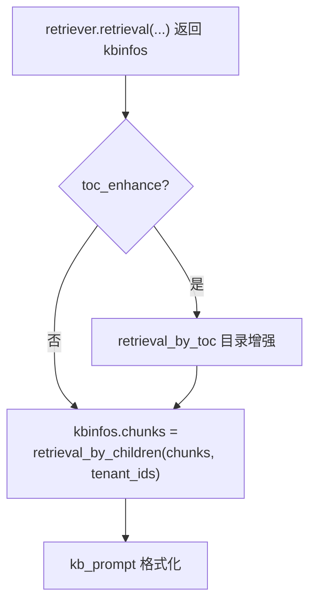
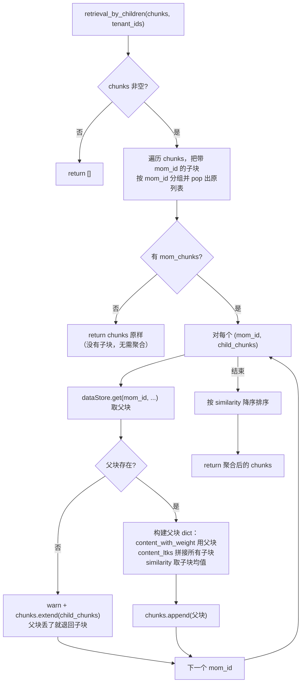
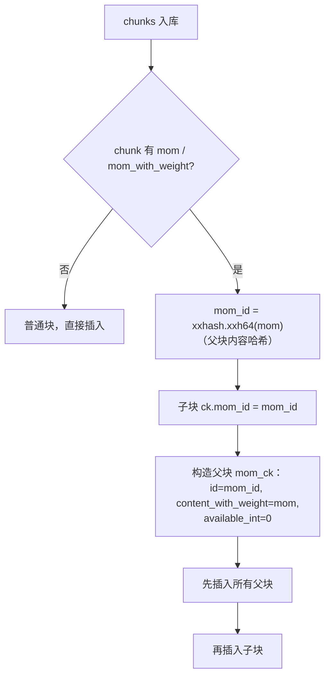

retrieval_by_children 是 RAGFlow 的「父子块聚合（small-to-big）」检索后处理：把召回结果里那些「带父块指针（mom_id）」的子块，
替换/合并成它们共同的**父块**（更大、上下文更完整的 chunk），再喂给 LLM。核心思想是「**用小块精确召回，用大块提供上下文**」。

签名：`retrieval_by_children(chunks: list[dict], tenant_ids: list[str]) -> list[dict]`
（`rag/nlp/search.py:1001`）

# 一、触发位置

在检索链路的末尾、`kb_prompt` 之前，紧跟 `retrieval_by_toc` 之后，是无条件执行的（不依赖任何开关）。

关键点：

- 三个调用方，都在「普通召回 →（可选 TOC 增强）→ **父子聚合**」的固定位置：
  - `dialog_service.py:846`（聊天主链路）
  - `agent/tools/retrieval.py:229`（Agent Retrieval 工具）
  - `chunk_api.py:451`（检索测试 API）

# 二、主流程

# 三、父子块模型是怎么来的（前置：入库阶段）

父块在**入库**时生成（`rag/svr/task_executor.py` 的 `insert_chunks`，1242-1282 行）：

关键点：

- `mom_id` 是**父块内容的哈希**（`xxhash.xxh64(mom)`），所以内容相同的父块 id 稳定，且多个子块自然共享同一个 `mom_id`。
- 父块 `available_int = 0`：**不参与常规召回**（和 TOC 块一样的「标记 chunk」隔离手法），只能靠 `mom_id` 精确 `dataStore.get` 取出。
- 父块只保留少数字段（`id / content_with_weight / doc_id / docnm_kwd / kb_id / available_int / position_int / 时间戳 / 页码`），其余删掉。

# 四、设计方案要点

1. small-to-big 检索模式

- **小块召回**：子块更短、语义更聚焦，向量/全文匹配更准。
- **大块喂给 LLM**：父块携带更完整的上下文，回答质量更好。`retrieval_by_children` 就是二者之间的「替换/合并」动作。

2. 多子块命中同一父块 → 合并成一个

- 多个子块命中同一 `mom_id` 时，只生成一个父块，避免「同一个父块重复出现」浪费上下文。
- 合并时的字段策略：
  - `content_with_weight`：用父块正文（父块本身就是完整内容）。
  - `content_ltks`：**拼接**所有子块的 token 文本（`" ".join(...)`），保留子块的词汇信息。
  - `important_kwd`：扁平化合并所有子块的关键词。
  - `similarity / vector_similarity / term_similarity`：统一取子块 `similarity` 的**均值**（注意三者都用 `ck["similarity"]`，不做区分，是简化处理）。

3. 父块缺失的安全回退

- 若 `dataStore.get(mom_id)` 拿不到父块（索引不一致、父块被清等），记录 warning 并把子块 `extend` 回结果，保证不丢内容。

4. 向量占位与按需回填

- 父块没有向量（`available_int=0` 不参与向量召回），`vector` 用 `[0.0]*1024` 占位；
  若子块带 `*_vec` 字段（OceanBase 路径会随结果带回），则取第一个子块的向量覆盖。
  ES 路径主检索不拉向量，这里自然就是占位，符合「向量按需回填」的整体优化。

5. 原地 pop 的分组遍历

- `while i < len(chunks)` + `chunks.pop(i)` 实现「边遍历边分组」：pop 后 i 不变，继续检查被顶到当前位置的元素，
  是标准的 in-place 过滤写法。

6. 最终按 similarity 降序

- 聚合后的结果（父块 + 未被替换的普通块）统一按 `similarity` 降序排序，保证「最相关的父块」排前面，供下游 `kb_prompt` 按序截断。

# 五、结果流向

`retrieval_by_children` 返回的 chunks 继续走：

1. `kb_prompt(kbinfos, max_tokens)` → 树形文本。
2. `kwargs["knowledge"]` 注入 system prompt 的 `{knowledge}` 占位符。
3. `message_fit_in` 裁剪后交给 LLM。

至此，整条检索链路完整闭环：`apply_meta_data_filter`（范围收窄）→ `retrieval`（多路召回+重排）→
`retrieval_by_toc`（目录增强）→ `retrieval_by_children`（父子聚合）→ `kb_prompt`（格式化）→ `message_fit_in`（裁剪）→ LLM 生成。
