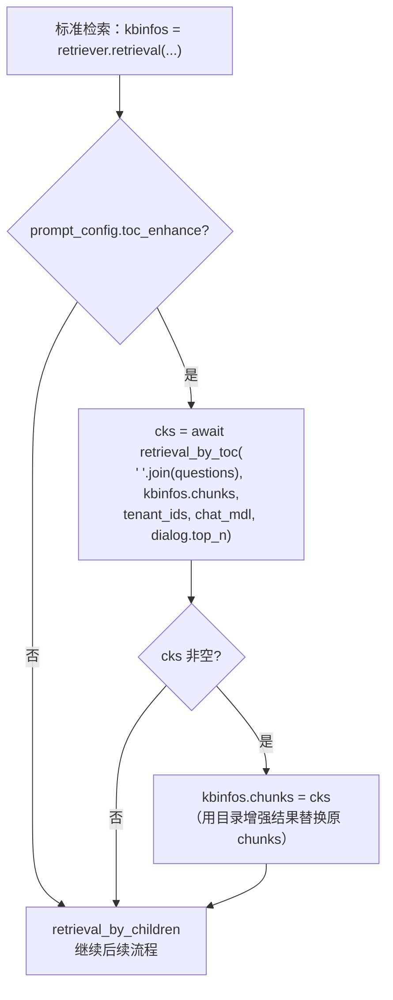
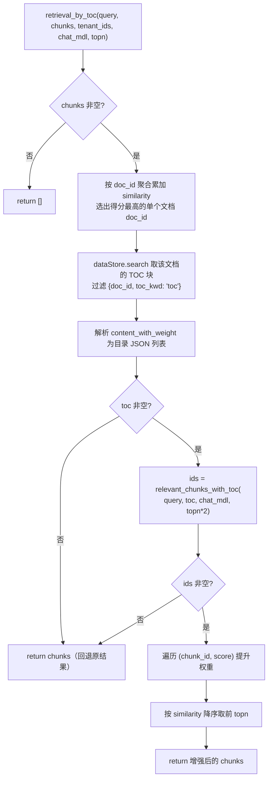
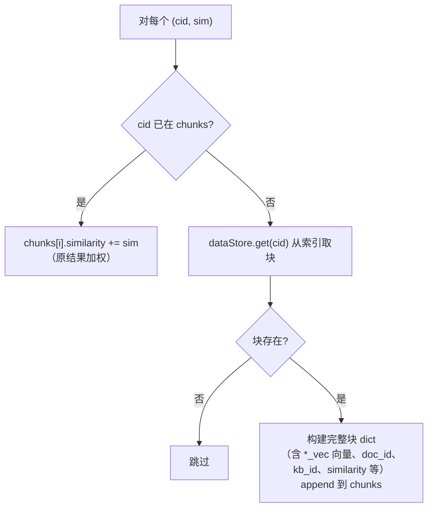
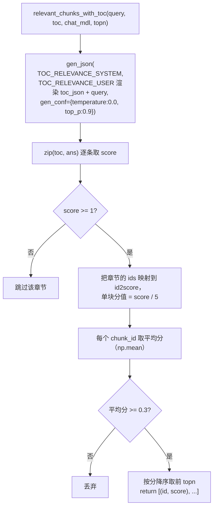

retrieval_by_toc 是 RAGFlow 的「目录增强（TOC enhance）」检索：在常规向量/全文召回之后，利用文档的目录结构，
先用 LLM 找出与查询最相关的章节，再把这些章节下的块提权（或补召回），从而提升长文档场景下的精准度。
核心思路是「**先定位文档 → 再定位章节 → 章节提权**」。

# 一、触发位置

（在标准检索路径中） 位于 `retriever.retrieval` 之后、`retrieval_by_children` 之前，由 `prompt_config["toc_enhance"]` 控制。

关键点：

- 触发位置在 dialog_service.py:842-845，**只在标准检索分支（else 分支）生效**，深度研究（DeepResearcher）路径不走 TOC 增强。
- 除了聊天链路，还有两个调用方复用同一函数：
  - `agent/tools/retrieval.py:223`：Agent 的 Retrieval 工具，`self._param.toc_enhance` 开启时调用。
  - `api/apps/restful_apis/chunk_api.py:447`：检索测试 API，`toc_enhance` 参数开启时调用。
- 三者都是「先普通召回 → TOC 增强 → `retrieval_by_children` 父子聚合」的固定顺序，TOC 增强夹在中间。

# 二、retrieval_by_toc 主流程

提权细节（BOOST 节点）：

# 三、relevant_chunks_with_toc（LLM 章节评分）

# 四、TOC 是怎么来的（前置：入库阶段）

目录增强依赖「目录块」这个特殊 chunk，它在文档解析入库时生成，而不是检索时现算：

- 生成入口：`rag/flow/extractor/extractor.py` 的 `_build_TOC`（Extractor 组件的 `field_name=="toc"` 分支）。
- 目录本身由 `run_toc_from_text`（文本 LLM，非视觉）从文档块中抽取，得到带 `chunk_id` 的目录条目。
- `_build_TOC` 把每个目录条目映射到它覆盖的块 id 列表 `ids`（extractor.py:48-60，按 chunk_id 区间推算）。
- 最后构造一个**特殊 chunk** 存目录（extractor.py:62-70）：
  - `toc_kwd = "toc"`：打上目录标记，检索时靠 `{doc_id, toc_kwd: "toc"}` 精确过滤取出。
  - `content_with_weight = json.dumps(toc)`：目录结构整体作为 JSON 存进去。
  - `available_int = 0`：**不参与常规召回**，避免目录块污染普通检索结果。
  - `page_num_int = [100000000]`：页码极大值，排序时永远排最后。
  - `id = xxhash(content + doc_id)`：稳定 id。
- 同样在 `rag/svr/task_executor.py:665`、`task_executor_refactor/task_handler.py:583` 也有 `d["toc_kwd"]="toc"` 的写入。

# 五、设计方案要点

1. 两段式定位（先文档、后章节）

- 第一步：把召回结果按 `doc_id` 聚合累加 `similarity`，选出**得分最高的单个文档**（search.py:919-926）。
- 第二步：只对这个文档做目录章节定位。因此 TOC 增强本质是**单文档**增强，多文档相关时其余文档的章节不会被提升。

2. 目录块是「标记 chunk」而非独立索引

- TOC 复用 chunk 索引存储，靠 `toc_kwd="toc"` 标记 + `available_int=0` 隔离：
  既能用 `dataStore.search` 按 `doc_id` 精确取回，又不会混入常规召回结果。这是一种低成本的「伪独立索引」设计。

3. LLM 层级评分 + 确定性采样

- 评分范围 5/3/1/0/-1，`temperature=0.0` + `top_p=0.9` 保证输出稳定可复现。
- 系统提示词里带「层级遍历」规则：高层（level 1）强相关 → 子项也可能相关；高层无关 → 深层通常也不相关。用 3 组 few-shot 示例锚定评分口径。
- 走 `gen_json`，自带 LLM 缓存 + `max_retry=2` 重试 + `json_repair` 容错。

4. 两级阈值过滤 + 归一化

- 第一级（章节层）：LLM 给的 `score` 必须 `>= 1` 才进入候选。
- 第二级（块层）：章节分数归一化为 `score/5`（0.2~1.0），一个块若命中多个相关章节取**平均**，最终只保留 `>= 0.3` 的块。
- 候选章节数取 `topn*2`（默认 topn=6 → 12 个章节），最终块数截断到 `topn`。

5. 提权而非替换

- 已在召回结果里的相关块：直接 `similarity += sim`（在原相似度基础上加分）。
- 未召回到但章节命中的块：从索引 `dataStore.get(cid)` 取回并补进结果，构造完整块结构
  （含 `*_vec` 向量字段，默认 `vector_size=1024`，遇到 `*_vec` 后缀字段则用真实维度覆盖）。
- 最后统一按 `similarity` 降序取 topn，保证输出规模稳定。

6. 失败安全（锦上添花语义）

- 三处回退：`chunks` 为空、文档无 `toc`、LLM 无相关章节，都直接 `return chunks`（返回原召回结果）。
- 外层调用方（dialog_service / agent / chunk_api）又各自用 `if cks:` 判断，为空就不替换。整条 TOC 增强链路**任何一步失败都不影响主流程**。

7. 值得注意的实现细节

- 提权时 `similarity`、`vector_similarity`、`term_similarity` 三者都被置为同一个 `sim`（search.py:982-984），
  即补召回的块在三种分数口径下都是「章节分数」而非真实检索分，可能与既有块的分数口径不一致，但最终只按 `similarity` 排序，影响有限。
- `dataStore.get(cid, idx_nms[0], kb_ids)` 用 `idx_nms[0]`（第一个租户索引）但 `kb_ids` 是单文档所属 KB，
  与「单文档定位」的前提一致；若 chunk 归属多租户/多索引会有边界情况，但聊天场景通常单租户。

# 六、提示词模板

## 6.1 系统提示词（rag/prompts/toc_relevance_system.md）

- 角色：层级目录相关性评估专家。
- 输入：TOC 条目列表（`level` + `title`）+ 用户查询。
- 评分体系：5（高度相关）/ 3（部分相关）/ 1（弱相关）/ 0（无关）/ -1（明确无关或矛盾）。
- 层级遍历：level 越小层级越高；高层强相关 → 子项大概率相关；高层无关 → 深层通常也无关。
- 输出：按输入顺序返回 JSON 数组，每个条目加 `score` 字段，只输出 JSON。
- 含 3 组 few-shot 示例（机器学习 / 市场营销 / 物理）。

## 6.2 用户提示词（rag/prompts/toc_relevance_user.md）

- 重申遍历与评分规则，注入 `{{ toc_json }}`（只取 `level` + `title`）和 `{{ query }}`。
- 强调只输出带 `score` 的 JSON 数组。
