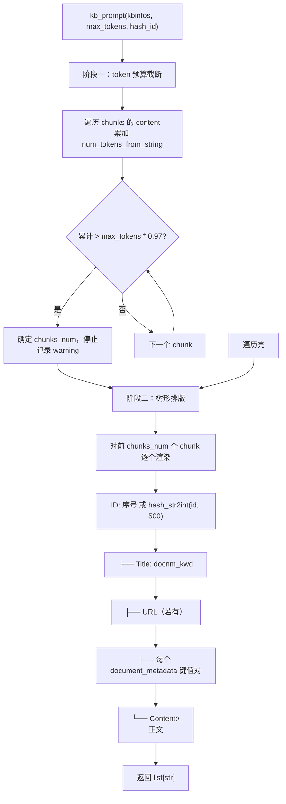
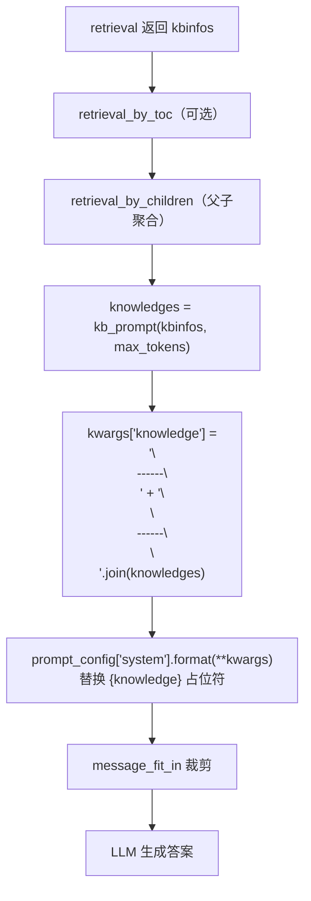

kb_prompt 是 RAGFlow 里「检索结果 → 文本提示词」的格式化函数：把 `kbinfos["chunks"]` 转成一串
「树形结构」的文本片段，供 LLM 阅读。它是检索和生成之间的最后一道桥，核心职责是：**按 token 预算截断 + 树形排版**。

签名：`kb_prompt(kbinfos, max_tokens, hash_id=False) -> list[str]`
返回一个字符串列表，每个元素是一段格式化的 chunk 文本，由调用方用分隔符拼接后注入 system prompt 的 `{knowledge}` 占位符。

# 一、调用位置

| 调用方 | 参数 | 说明 |
|--------|------|------|
| dialog_service.py:870 | `kb_prompt(kbinfos, max_tokens)` | 聊天主链路，max_tokens=模型 max_tokens |
| dialog_service.py:1907 | 同上 | 另一条链路（问题生成等） |
| agent_with_tools.py:321 | `(retrievals, chat_mdl.max_length, True)` | Agent，`hash_id=True` |
| agent/tools/retrieval.py:271 / base.py:227 | `(kbinfos, 200000, True)` | Agent 检索工具，预算固定 200000 |
| tree_structured...py:143 | `(ret, chat_mdl.max_length*0.5)` | DeepResearcher，只用一半预算 |

关键点：Agent 侧统一传 `hash_id=True`（ID 用哈希隐藏），聊天链路默认 `False`（ID 直接用序号）。

# 二、两阶段流程



# 三、输出格式（树形文本）

单个 chunk 渲染成这样的文本（box-drawing 字符排版）：

```
ID: 0
├── Title: 产品说明书.pdf
├── URL: https://example.com/doc.pdf
├── author: alice
├── year: 2026
└── Content:
这是该 chunk 的正文内容……
```

- `draw_node(k, line)`：值非 str 先转 str；空值跳过整行；正文里的换行用 `re.sub(r"\n+", " ", ...)` 压成单行，避免破坏排版。
- 各字段取值都走 `get_value(ck, "content", "content_with_weight")`、`get_value(ck, "docnm_kwd", "document_name")` 这类
  「主字段 → 兜底字段」的兼容取值，屏蔽不同数据源字段名差异。
- `URL` 和 `document_metadata` 是可选字段，存在才渲染。

# 四、设计方案要点

1. token 预算 97% 截断（第一道闸）

- 累加每个 chunk 的 content token，一旦超过 `max_tokens * 0.97` 就停止，只保留前面的 `chunks_num` 个 chunk。
- 留 3% 余量，与 `message_fit_in` 在调用方的 0.92/0.95/0.97 系数是同一套「给 prompt 结构开销和输出留空间」的思路。

2. 只统计正文 token，不计「排版外壳」

- 阶段一累计的 token 只算 `content`，而阶段二会额外加上 `ID/Title/URL/metadata` 这些包装文本。
  所以实际注入的 token 会略高于预算值，预算本身是个**近似**下界。
- 空 content 的 chunk（`if not c: continue`）不计入 `chunks_num`，但阶段二按 `[:chunks_num]` 切片时仍可能带出「空 chunk 的壳」。

3. 一个隐性的死赋值

- 阶段一里 `knowledges = knowledges[:i]` 的赋值是**无效的**：紧接着阶段二开头 `knowledges = []` 就把它覆盖了。
  真正的截断其实靠 `chunks_num` 变量在阶段二 `kbinfos["chunks"][:chunks_num]` 里完成。功能正确，但代码有误导性冗余。

4. `hash_id` 控制 ID 暴露

- `hash_id=False`（聊天）：ID 直接用遍历序号 `0,1,2...`，简短且够用。
- `hash_id=True`（Agent）：`hash_str2int(id, 500)` = `sha1(id) % 500`，把真实 chunk_id 藏起来，只用 0-499 的短 ID 做引用标记。
  注意 mod=500 意味着碰撞概率较高，但这里 ID 只用于「引用回填」的展示索引，不是检索键，可接受。

5. 元数据健壮性（回归修复 #14651）

- `meta = ck.get("document_metadata") or {}` 里的 `or {}` 同时兜住了「字段为 `None`」和「字段缺失」两种情况，
  避免 `NoneType` 没有 `.items()` 的崩溃。有单测 `test_kb_prompt_metadata.py` 专门锚定这三个场景
  （null / missing / 有值渲染）。

6. 返回 list 而非拼接后的整串

- 返回字符串列表，把「用分隔符拼接」的决定权交给调用方。聊天链路用
  `"\n------\n" + "\n\n------\n\n".join(knowledges)` 拼接后填入 `{knowledge}`，便于在多个知识块之间加视觉分隔。

# 五、结果流向（以聊天主链路为例）


