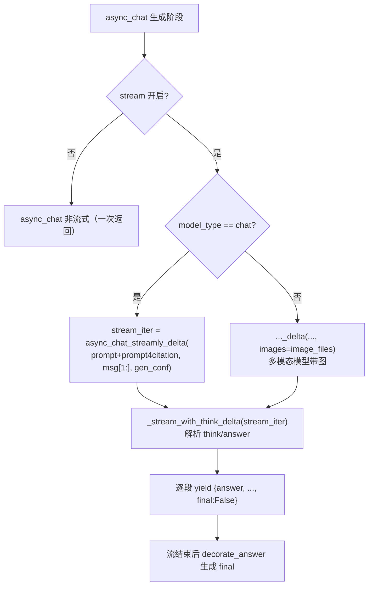
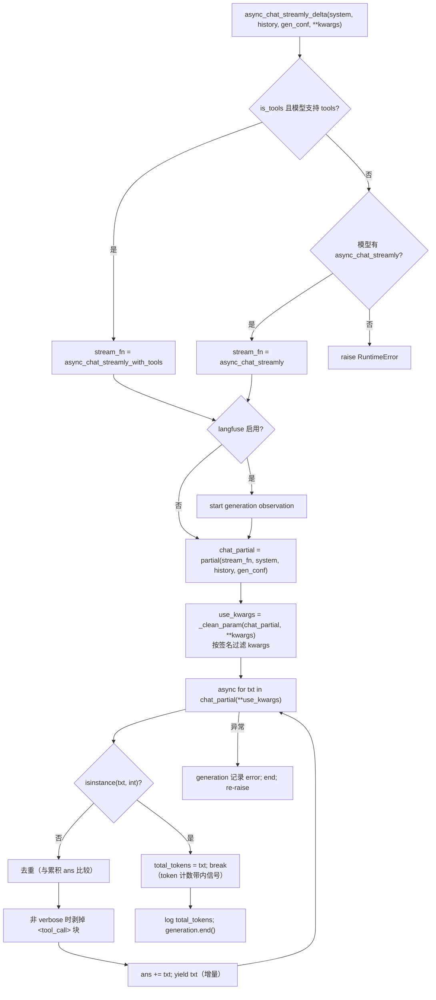
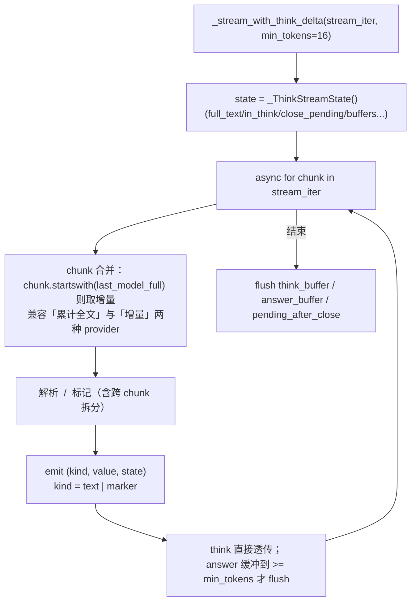

async_chat_streamly_delta 是 `LLMBundle` 里「流式对话」的增量版实现：以流式方式调用底层 LLM，
**逐 token（增量）** yield 返回内容，支持工具调用、Langfuse 追踪、思考标记去重、工具调用隐藏。
它是聊天「打字机效果」的数据源，下游经 `_stream_with_think_delta` 解析后逐段推给前端。

签名：`async_chat_streamly_delta(system: str, history: list, gen_conf: dict = {}, **kwargs)`
（`api/db/services/llm_service.py:507`）

# 一、调用位置（聊天主链路的流式分支）

关键点：

- `system = prompt + prompt4citation`（系统提示词 + 引用指南），`history = msg[1:]`（去掉 system 后的对话）。
- 多模态模型（`model_type != "chat"`）额外传 `images=image_files`。
- 调用方还有：`agent/component/llm.py:290/300`（Agent LLM 组件）、`dialog_service.py:354/356`（无知识库的 solo 聊天）、
  `dialog_service.py:1934`（问题生成）。

# 二、async_chat_streamly_delta 内部流程

# 三、stream_fn 选择与 `_clean_param`

- **三优先级**：① 工具模式且模型支持 → `async_chat_streamly_with_tools`；② 否则有 `async_chat_streamly` 就用它；③ 都没有 → 抛 `RuntimeError`。
- **`_clean_param`（llm_service.py:322）**：用 `inspect.signature` 读底层 stream 方法的签名，把 `**kwargs` 里它不接受的参数过滤掉；
  若方法本身有 `**kwargs`（VAR_KEYWORD），则原样透传。这层是为「不同 provider 底层签名不一致」做的兼容（比如 `images` 只有视觉模型接受）。

# 四、与 `async_chat_streamly` 的区别

两个方法逻辑几乎完全一致（同样的 stream_fn 选择、token 计数、`</think>` 去重、tool_call 隐藏），唯一区别是 yield 什么：

| 方法 | yield 内容 | 适用 |
|------|-----------|------|
| `async_chat_streamly` | `ans`（**累积全文**） | 老式/简单消费方，每次拿到完整答案 |
| `async_chat_streamly_delta` | `txt`（**增量 token**） | 真正的流式，逐段推给前端 |

# 五、下游：`_stream_with_think_delta` 的 think/answer 分离

`async_chat_streamly_delta` 只负责吐「原始增量」，思考标记的解析在 `dialog_service.py:1662` 的 `_stream_with_think_delta` 里完成：

- **状态机**：`_ThinkStreamState` 维护 `in_think`（是否在思考块内）、`close_pending`（`</think>` 已出现但内容未接上）、
  `pending_after_close`（关闭标记后紧跟的待输出内容）等，处理标记跨 chunk 拆分的边界情况。
- **智能缓冲**：answer 内容累积到 `min_tokens=16` 才输出，减少网络传输次数；think 内容直接透传（前端实时展示思考过程）。
- **marker 事件**：`<think>` / `</think>` 以 `("marker", ...)` 形式发出，调用方据此给前端加 `start_to_think` / `end_to_think` 标志。

# 六、设计方案要点

1. 带内 token 计数信号

- 底层模型在流式输出**末尾** `yield` 一个 `int`（total_tokens），上层识别到 `isinstance(txt, int)` 就记录并 `break`。
  这是一种「带内」约定：token 数不走单独的回调，而是混在数据流里用类型区分。

2. `</think>` 去重

- reasoning 类模型可能重复输出 `</think>`；代码在累积时判断「当前 txt 以 `</think>` 结尾 且 ans 已以 `</think>` 结尾」，
  就把 ans 里旧的 `</think>` 剥掉，保证最终答案里只留一个关闭标记。

3. 工具调用隐藏

- `verbose_tool_use=False` 时用 `re.sub(r"<tool_call>.*?</tool_call>", "", txt, DOTALL)` 剥掉工具调用块，
  避免把内部工具调用细节流给用户。需要调试时切到 verbose 模式保留。

4. 可观测性（Langfuse）

- 流式开始创建 generation observation，结束时写 `output` + `usage_details.total_tokens`；
  异常路径也记录 error 并 `end()`，保证追踪不因异常丢失。追踪失败不影响主流程（外层 try/except 兜住）。

5. 异常传播语义

- `async_chat_streamly_delta` 捕获异常后：更新 Langfuse → 记录 → **re-raise**。
  所以异常会一路抛回调用方（async_chat），由上层决定降级/报错，不在这一层吞掉。

6. 最终答案的组装（流结束之后）

- 调用方收集 `last_state.full_text`，经 `_extract_visible_answer` 提取可见答案（保留 `<think>...</think>` 结构），
  再交给 `decorate_answer` 插入引用标记，最后 `yield` 一个 `final=True` 的结果。整个流式过程是
  「逐段 emit 中间结果 → 最后 emit 一个带引用的 final」。

7. `_clean_param` 的健壮性边界

- 依赖 `inspect.signature` 反射；对 C 扩展/装饰器包装后的函数可能拿不到准确签名，此时 VAR_KEYWORD 分支兜底（透传）。
- 这是「一 Bundle 适配多 provider 不同底层方法」的关键：同一个 `images` 参数，视觉模型接受、纯 chat 模型不接受，
  靠 `_clean_param` 自动裁剪。
